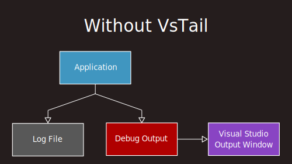
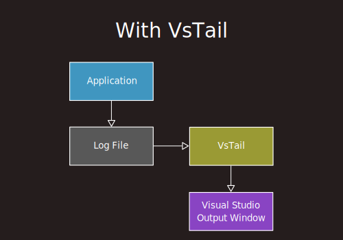

# VsTail.Proxy<br><sup><sub>Connects to `VsTail`, which speeds up Visual Studio debug output by orders of magnitude.</sup></sub>

<!--- Note: This image looks fine in most markdown renderers, 
            but not in Visual Studio, whose built-in markdown renderer is broken nowadays. 
			Someone has brought it to their attention, (https://developercommunity.visualstudio.com/t/10774870)
			and last I checked they were "investigating". -->
<p align="center">
<br/>
</p>

`MikeNakis.VsTail.Proxy` is a tiny open-source dotnet library that you can use for integrating `MikeNakis.VsTail` into your application. 

`MikeNakis.VsTail` is a separate application, which is not open-source.

# The problem

One day I noticed that the debug build of my dotnet application was significantly slower when debugging in Visual Studio than when not debugging.

I suspected that logging might be the culprit, so I did a little experiment:

I compared the time it takes to emit log lines using two different methods:

- The **File-WriteLine** method:
  - Emitting log lines via `System.IO.StreamWriter.WriteLine()` on a `System.IO.FileStream`, followed by `Flush()` after each line.
- The **Debug-WriteLine** method:
  - Emitting log lines via `System.Diagnostics.Debug.WriteLine()`.

My observations were as follows:

- On average, the **File-WriteLine** method takes a reasonable 3 microseconds per line.

- On average, the **Debug-WriteLine** method takes an _**absolutely terrifying 1 millisecond per line**_.

(On various computers, the latest being an HP ZBook Fury 16 G10 with an Intel® Core™ i7-13850HX at 2.10 GHz.)

To ensure that my findings were unbiased, I did the following:
- I tried with bursts of 10, 100, 1000, or 10000 log lines, in case it made a difference.
- I tried following each burst with a sleep of 100 milliseconds, in case something needed some time to cool down.
- I tried either with or without the VSColorOutput plugin, in case it somehow slows things down.

None of the above made any difference whatsoever: The **Debug-WriteLine** method is an astounding 350 times slower than the **File-WriteLine** method.

Further testing revealed that with `File-WriteLine` the CPU load is 100%, while with `Debug-WriteLine` the CPU load is 
about 30%. This means that `Debug-WriteLine` is not keeping the CPU fully occupied, but it is still consuming about 130 
times more CPU than `File-WriteLine`.

I do not know what are the technical or managerial excuses behind this situation,
and I do not care; to me, it clearly shows that some folks at Microsoft are incompetent dimwits
who should be milking goats instead of pretending to develop world-class software.

# The solution

The idea behind `MikeNakis.VsTail` is that we abandon `System.Diagnostics.Debug.WriteLine()`
and instead we do all of our logging into a text file. (Which we are probably already doing, anyway.)
Then, we have an external process, 
which keeps reading text as it is being appended to the log file,
and emits that text to the debug output window of Visual Studio. 

Thus, we avoid the formidable cost of `System.Diagnostics.Debug.WriteLine()` while Visual Studio is running, and we save
a millisecond for every single line of log output.

# How it works

Without `MikeNakis.VsTail`, our application typically sends its logging output both to a log file 
and to the debug output stream. Visual Studio intercepts the debug output stream and renders it in its output window.

<p align="center">

</p>

As I have already explained, this is extremely slow.

With `MikeNakis.VsTail`, our application sends its logging output only to the log file.
`MikeNakis.VsTail` keeps polling that log file, and sending text to the output window of Visual Studio.

<p align="center">

</p>

The polling is done at a rate of 5 times per second, 
which is frequent enough to be perceived as instantaneous, 
and at the same time relaxed enough to have an imperceptible CPU consumption.

# How to use

First, reconfigure the way logging is done in your application so that it only writes to a log file. 
(In other words, remove all calls to `System.Diagnostics.Debug.WriteLine()`.)

Then, include the `MikeNakis.VsTail.Proxy` library to your application, and invoke it as follows:

```csharp
object vsTailAnchor = MikeNakis.VsTail.Proxy.VsTailProxy.Connect( filePath, solutionName ) //
        ?? throw new Sys.InvalidOperationException();
```

Do the above as early as possible during the startup of your application, passing it the following:

- The full path name to the log file of your application.
- The name of your solution.

**Important:** Store the result in a member variable of your application
so that it will stay alive until your application process ends.

That's it. 
From that moment on, you will enjoy much faster logging in Visual Studio.

# Caveats

- Visual Studio is in the habit of emitting some diagnostic information (e.g. process termination messages)
directly to the debug output stream, bypassing your logging facility, and therefore bypassing VsTail. 
As a result, these messages will appear out of order with respect to the log lines that go via VsTail.
For example, if you instruct your application to shut-down,
you may see in the Debug Output Window some cleanup-related log lines, 
followed by a Visual-Studio-generated "process exited with exit code 0" message,
followed by a few more cleanup-related log lines. 
This is happening because the last few lines were still in transit at the time that the process exited.

- When Visual Studio displays an application-modal dialog box, (for example, any kind of "are you sure? (y/n)" dialog,)
it enters some bizarre state in which it is incapable of processing messages from external applications like VsTail.
When VsTail sends text to be logged by Visual Studio but Visual Studio is in such a state, 
Visual Studio refuses to receive the text, so VsTail takes notice and retries later. 
Thus, it is important to keep in mind that while Visual Studio is showing an application-modal dialog box, 
logging is suspended, which means that the logging text in the Output Window may be outdated.

# Status of the project

This utility is still work in progress, and at a very early stage of development.
It is largely untested under real work conditions,
so there may be situations where it does not work very well, or it does not work at all.

# License

Published under the MIT license. Do whatever you want with it.

Also see [LICENSE.md](LICENSE.md)

# Contributions

There are a few potential areas of improvement where I could use some help:

- Create an installer or NuGet package (Never done this before, help would be welcome)
- Convert the standalone application into a Visual Studio extension (Never done this before, help would be welcome)
- Give some love to the application icon. (It could use some improvement from an actual artist rather than me I am just a programmer.)

If you do decide to contribute, please contact me first to arrange the specifics.
